# opsx-construct: Parallel Build + Deliberate Review Protocol

**Date**: 2026-05-02
**Status**: Approved
**Depends on**: opencode-ensemble, opsx-multiplex (opsx-deliberate pattern), @codery/probes

## Problem

Spec-complete projects with full E2E test suites need an automated build pipeline that:

1. Implements features in parallel using isolated worktrees
2. Runs structured multi-agent code review on each implementation
3. Validates against architecture directives and specs
4. Flags test/spec issues for human resolution (never auto-fixes tests)
5. Runs regression passes between layers
6. Survives crashes with full resume capability

## Architecture

**Form factor**: OpenCode skill/command, installed like opsx-multiplex. Lives in `skills/opsx-construct/` with a command entry point.

**Orchestration model**: Lead session orchestrates. Implementation uses opencode-ensemble teammates (parallel worktrees). Review uses subagent dispatches (opsx-deliberate FSM pattern). Fix cycle keeps teammates alive via `team_message`.

**State**: Single JSON file `.openspec/tmp/construct-state.json`. Work queue tracks every task's exact phase/state for crash recovery.

## Protocol — 9 Stages

### Phase 0: Setup

1. Load `tasks.md` — determine layer ordering (from opsx-arrange output)
2. Detect `opsx-*` subagents from `opencode.json` — user selects reviewers via checkbox
3. Run existing E2E tests — establish baseline pass rate
4. Init state file with config (max_parallel, reviewers, etc.)

### Phase 1: Architecture Deliberation

For each dependency layer before implementation:

1. Gather specs + design.md + existing code + prior layer arch directives
2. Round-robin subagent deliberate review (opsx-deliberate FSM pattern) — produce architectural directives covering concurrency, shared interfaces, patterns, cross-feature consistency
3. Consensus among all reviewers required
4. **HARD GATE**: Present directives to human via OpenCode question tool
   - **Approve**: Save as `arch-guidance-L{N}.md`, proceed to Phase 2
   - **Amend**: Human edits/overrides, re-present until approved
   - **Abort**: Workflow exits. State preserved. Resume with `/opsx-construct --resume`

### Phase 2: Parallel Implementation

1. For each task in current layer, spawn ensemble teammate via `team_spawn`
   - Each gets own worktree and branch
   - Prompt includes: feature spec, architecture directives, relevant E2E test paths, project design.md
   - Instruction: **never modify tests**
   - Respect `max_parallel` — only spawn when `in_progress < max_parallel`
2. Teammates implement in parallel
3. Teammate finishes → run relevant E2E tests against its worktree
   - Pass → mark ready for review
   - Fail → lead sends failure details via `team_message`, teammate reworks (up to `max_impl_attempts`)

### Phase 3: Per-Feature Pre-Merge Review

For each completed teammate branch (sequential):

1. Round-robin subagent review of branch diff
   - **Prompt template — three review axes:**
     1. **Coding best practices**: Clean code, error handling, naming, DRY, appropriate patterns
     2. **Architecture compliance**: Follows arch directives from Phase 1, consistent with project design, appropriate abstractions, cross-feature compatibility
     3. **Test/spec correctness**: Are the E2E tests possibly wrong? Do specs contradict each other? Are requirements unworkable?
2. Structured JSON feedback: code issues + test/spec flags
3. Test/spec issues → written to human issues queue, **never fixed by agents**
4. Code issues → lead sends feedback to teammate via `team_message` (teammate is alive, idle, waiting)
5. Teammate applies fixes → re-run relevant tests → re-review
6. Cycle continues until all reviewers satisfied (consensus on branch)

### Phase 3.5: Shutdown Teammates

1. `team_shutdown` all implementation teammates (branches preserved)
2. Commit pre-merge status to construct state

### Phase 4: Smart Merge

1. Create consolidated feature branch `construct-L{N}`
2. Classify branches: clean vs conflicting (`git merge --no-commit --no-ff` dry run per branch)
3. Merge clean branches into consolidated first
4. Merge conflicting branches pairwise into temp branches → conflict resolution via subagent dispatch
5. Merge resolved pairs into consolidated
6. Verify all branches accounted for

### Phase 5: Post-Merge Review

1. Round-robin subagent review of **full consolidated diff** (cross-feature interaction check)
   - Same three-axis prompt template
2. Code issues → subagent fix dispatch (new agent, applies to consolidated branch)
3. Test/spec issues → human issues queue
4. Re-review until all reviewers satisfied

### Phase 6: Regression Pass

1. Run **all** E2E tests that have implementations (full regression suite via `@codery/probes`)
2. All pass → proceed to Phase 7
3. Regressions found → subagent fix dispatch addresses them → mini review cycle → re-run full regression
4. Cycle continues until clean regression pass

### Phase 7: Finalize Layer

1. **HARD GATE**: Present layer summary to human via OpenCode question tool
   - Features built, test results, reviewer notes, human issues flagged
   - **Approve**: Merge consolidated branch to main
   - **Amend**: Return to appropriate phase for rework
   - **Abort**: State preserved for resume
2. Generate layer report (markdown)
3. More layers → return to Phase 1 with next layer
4. No more layers → DONE

## State File

Location: `.openspec/tmp/construct-state.json`

```json
{
  "version": 1,
  "status": "running | paused | aborted | complete",
  "project": "string (from openspec config)",
  "config": {
    "max_parallel": 3,
    "max_review_rounds": 3,
    "max_impl_attempts": 5,
    "reviewers": ["opsx-deepseek", "opsx-glm", "opsx-kimi"],
    "ensemble_team": "construct-{project}-L{N}"
  },
  "progress": {
    "current_layer": 2,
    "total_layers": 7,
    "current_phase": "implementing",
    "current_state": "S2.3",
    "last_phase_completed": 1
  },
  "arch_directives": {
    "1": ".openspec/tmp/arch-guidance-L1.md"
  },
  "work_queue": [
    {
      "id": "WQ-001",
      "task_id": "string",
      "spec": "string",
      "test_files": ["path"],
      "phase": "implementing | reviewing | approved | merged",
      "state": "S2.3",
      "status": "pending | in_progress | crashed | reviewing | approved | merged",
      "branch": "string | null",
      "teammate": "string | null",
      "attempts": 1,
      "review_rounds": 0,
      "test_results": { "pass": 0, "fail": 0 } | null,
      "error": "string | null",
      "updated_at": "ISO8601"
    }
  ],
  "completed": [],
  "human_issues": [
    {
      "id": "ISS-001",
      "source": "review | regression",
      "feature": "string",
      "work_queue_id": "string | null",
      "description": "string",
      "test_file": "path:line | null",
      "status": "open | resolved | wontfix",
      "raised_at": "ISO8601"
    }
  ],
  "error_log": [
    {
      "timestamp": "ISO8601",
      "work_queue_id": "string",
      "phase": "string",
      "error": "string",
      "recovery": "string"
    }
  ],
  "regression_history": [
    {
      "layer": 1,
      "run_at": "ISO8601",
      "total_tests": 0,
      "with_impl": 0,
      "passed": 0,
      "failed": 0
    }
  ]
}
```

## CLI Interface

```
/opsx-construct                          # Fresh start. Abort if state file exists.
/opsx-construct --resume                 # Resume from state file.
/opsx-construct --resume --layer 3       # Resume at specific layer.
/opsx-construct --max-parallel 2         # Override max parallel tasks.
/opsx-construct --resume --max-parallel 1 # Resume with reduced parallelism.
```

## Resume Logic

On `--resume`:

1. Load state file
2. Check ensemble team status — verify or recover teammate sessions
3. Scan work queue:
   - `in_progress` → check if teammate alive (team_status). Alive → re-attach. Dead → mark crashed.
   - `crashed` → reset to pending, increment attempts. If `attempts > max_impl_attempts` → flag for human.
   - `pending` / `queued` → queue for next available slot
   - `reviewing` → resume review cycle at saved state
   - `approved` → proceed to merge phase
4. Resume at `progress.current_phase` + `progress.current_state`

## Parallelism Control

**Config priority** (highest wins):

1. CLI flag: `--max-parallel N`
2. State file: `config.max_parallel`
3. Project config: `.opencode/construct.json` → `{ "max_parallel": N }`
4. Default: `3`

**Enforcement**: Before each `team_spawn`, count WQ items with `status = in_progress`. Only spawn when below limit. Pending items wait for slots.

## Key Invariants

- **Tests are never modified** by coding agents, fix agents, or review agents
- **Test/spec issues are flagged**, not fixed — written to human issues queue for external resolution
- **Architecture directives from Phase 1 guide all implementors** in Phase 2
- **Each worktree knows which E2E tests are relevant** to its feature
- **Two human gates**: after architecture (S1.5), after layer finalization (S7.1)
- **Abort at any gate preserves state** for later resume
- **State file is the single source of truth** — survives crashes, session loss, restarts

## File Structure

```
opsx-construct/
├── commands/
│   └── opsx-construct.md              # Command entry point
├── skills/
│   └── opsx-construct/
│       ├── SKILL.md                    # FSM: states, rules, gating
│       └── references/
│           ├── construct-state-schema.json
│           ├── review-prompt.md        # 3-axis review prompt template
│           ├── implementation-prompt.md # Teammate prompt template
│           ├── fix-prompt.md           # Fix agent prompt template
│           ├── architecture-prompt.md  # Architecture review prompt
│           └── workflow-design.md      # This doc
└── example.opencode.json               # Example config with opsx-* agents
```

## Dependencies

| Tool | Role |
|------|------|
| opencode-ensemble | Parallel teammates, worktrees, messaging, merge |
| opsx-multiplex (opsx-deliberate pattern) | Subagent dispatch FSM, consensus detection |
| @codery/probes | E2E test infrastructure (HTTP, SQL, TCP, WS) |
| opsx-arrange | Task dependency layer ordering |

## Cost Profile (estimates per layer)

| Phase | Dispatches (3 reviewers) |
|-------|---------------------------|
| Architecture deliberation | 3–9 (typical: 4) |
| Implementation | N teammates (parallel, one per task) |
| Per-feature review | 3–9 per task × N tasks |
| Post-merge review | 3–9 |
| Regression fix cycles | 0–6 |
| **Total per layer** | ~12–30 dispatches + N teammate sessions |

## Flow Diagram

```dot
digraph opsx_construct {
    rankdir=TB;
    node [shape=box, style=rounded];
    edge [fontsize=10];

    START [shape=doublecircle label="START\n/opsx-construct"];

    subgraph cluster_setup {
        label="PHASE 0: SETUP";
        style=dashed;
        S1 [label="S0.1: Load tasks.md\n(layer order from opsx-arrange)"];
        S2 [label="S0.2: Detect opsx-* subagents\n(user selects reviewers)"];
        S3 [label="S0.3: Run existing E2E tests\n(baseline pass rate)"];
        S4 [label="S0.4: Init state file"];
        S1 -> S2 -> S3 -> S4;
    }

    subgraph cluster_arch {
        label="PHASE 1: ARCHITECTURE DELIBERATION";
        style=dashed;
        A1 [label="S1.1: Select next\nlayer with pending tasks"];
        A2 [label="S1.2: Gather specs +\ndesign.md + existing code"];
        A3 [label="S1.3: Round-robin\narchitecture review"];
        A4 [label="S1.4: Consensus?"];
        A_RETRY [label="Next agent turn" shape=diamond];
        A5 [label="S1.5: Present to human\n(question tool)"];
        A_APPROVE [label="Save directives"];
        A_AMEND [label="Human amends"];
        A_ABORT [shape=doublecircle label="ABORT\nState preserved"];

        A1 -> A2 -> A3 -> A4;
        A4 -> A_RETRY [label="no" color=red];
        A_RETRY -> A3;
        A4 -> A5 [label="yes" color=green];
        A5 -> A_APPROVE [label="approve"];
        A5 -> A_AMEND [label="amend"];
        A5 -> A_ABORT [label="abort"];
        A_AMEND -> A5;
    }

    subgraph cluster_impl {
        label="PHASE 2: PARALLEL IMPLEMENTATION";
        style=dashed;
        I1 [label="S2.1: team_spawn per task\n(respect max_parallel)"];
        I2 [label="S2.2: Prompt: spec +\narch directives +\ntest paths + design.md"];
        I3 [label="S2.3: Teammates\nimplement"];
        I4 [label="S2.4: Run relevant\nE2E tests"];
        I5 [label="All teammates pass"];

        I1 -> I2 -> I3 -> I4;
        I4 -> I3 [label="fail: team_message\nfailure details" color=red];
        I4 -> I5 [label="pass" color=green];
    }

    subgraph cluster_prereview {
        label="PHASE 3: PER-FEATURE REVIEW";
        style=dashed;
        P1 [label="S3.1: Per branch (seq)"];
        P2 [label="S3.2: Round-robin\nsubagent review\n(3-axis prompt)"];
        P3 [label="S3.3: Structured\nfeedback"];
        P4 [label="S3.4: Test/spec issues?"];
        P5 [label="Write to human\nissues queue"];
        P6 [label="S3.5: Code issues →\nteam_message to\nidle teammate"];
        P7 [label="S3.6: Teammate fixes\n→ re-test → re-review"];
        P8 [label="S3.7: Consensus"];

        P1 -> P2 -> P3 -> P4;
        P4 -> P5 [label="yes" color=purple];
        P4 -> P6 [label="code issues" color=orange];
        P5 -> P6;
        P6 -> P7 -> P8;
        P8 -> P6 [label="not satisfied" color=red];
    }

    subgraph cluster_shutdown {
        label="PHASE 3.5: SHUTDOWN";
        style=dashed;
        SH1 [label="team_shutdown all\n(branches preserved)"];
    }

    subgraph cluster_merge {
        label="PHASE 4: SMART MERGE";
        style=dashed;
        M1 [label="S4.1: Create consolidated\nbranch"];
        M2 [label="S4.2: Classify:\nclean vs conflicting"];
        M3 [label="S4.3: Merge clean first"];
        M4 [label="S4.4: Conflicting →\npairwise resolve\n(subagent dispatch)"];
        M5 [label="S4.5: All merged"];

        M1 -> M2 -> M3 -> M4 -> M5;
    }

    subgraph cluster_postreview {
        label="PHASE 5: POST-MERGE REVIEW";
        style=dashed;
        R1 [label="S5.1: Round-robin review\nof full consolidated diff"];
        R2 [label="S5.2: Code issues →\nfix subagent dispatch"];
        R3 [label="S5.3: Test/spec issues →\nhuman queue"];
        R4 [label="S5.4: Consensus?"];

        R1 -> R2;
        R1 -> R3;
        R2 -> R4;
        R4 -> R1 [label="no" color=red];
    }

    subgraph cluster_regression {
        label="PHASE 6: REGRESSION";
        style=dashed;
        RG1 [label="S6.1: Full regression\nsuite (@codery/probes)"];
        RG2 [label="S6.2: All pass?"];
        RG3 [label="Fix + mini review"];

        RG1 -> RG2;
        RG2 -> RG3 [label="regressions" color=red];
        RG3 -> RG1;
    }

    subgraph cluster_finalize {
        label="PHASE 7: FINALIZE";
        style=dashed;
        FINAL [label="S7.1: Present to human\n(question tool)"];
        COMMIT [label="S7.2: Merge to main"];
        REPORT [label="S7.3: Layer report"];
        NEXT [label="More layers?"];
        DONE [shape=doublecircle label="DONE"];

        FINAL -> COMMIT [label="approve"];
        FINAL -> FINAL [label="amend → rework"];
        FINAL -> A_ABORT [label="abort"];
        COMMIT -> REPORT -> NEXT;
        NEXT -> DONE [label="no"];
    }

    START -> S1;
    S4 -> A1;
    A_APPROVE -> I1;
    I5 -> P1;
    P8 -> SH1;
    SH1 -> M1;
    M5 -> R1;
    R4 -> RG1 [label="yes" color=green];
    RG2 -> FINAL [label="yes" color=green];
    NEXT -> A1 [label="yes" color=blue];
}
```


